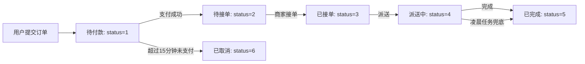
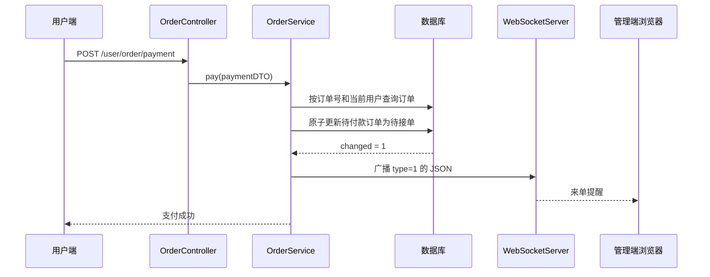

# 苍穹外卖 Day 10 学习讲解

本节完成三个面向真实业务的功能：**订单状态自动处理**、**支付后的来单提醒**和**用户催单提醒**。它们分别对应“没有人主动操作时，系统如何自行收口”“服务端如何主动通知管理端”这两个问题。

本文以当前项目中的实现为准。当前项目使用本地模拟支付接口 `POST /user/order/payment`，因此“支付回调”在这里指该接口成功完成订单状态更新之后，而非第三方微信支付平台回调。

## 一、核心业务总览



订单实体 `Orders` 的状态常量已经定义在 `sky-pojo` 模块中：

| 值 | 常量 | 业务含义 |
| --- | --- | --- |
| 1 | `PENDING_PAYMENT` | 待付款 |
| 2 | `TO_BE_CONFIRMED` | 待接单 |
| 3 | `CONFIRMED` | 已接单 |
| 4 | `DELIVERY_IN_PROGRESS` | 派送中 |
| 5 | `COMPLETED` | 已完成 |
| 6 | `CANCELLED` | 已取消 |

除了订单状态，还有支付状态：0 未支付、1 已支付、2 已退款。二者不能混为一谈。例如，一笔订单取消后仍可能需要记录“已退款”。

## 二、Spring Task：让代码在指定时机自动运行

### 1. 它解决什么问题

普通 Controller 方法只有在客户端发出 HTTP 请求时才会运行。但“订单 15 分钟未支付后取消”没有一个客户端会恰好在第 15 分钟发请求，因此需要服务器自己定期检查。

Spring Task 是 Spring 提供的轻量级任务调度机制。启动后，Spring 会在后台调度线程中调用标注了 `@Scheduled` 的方法。适用于超时处理、日报生成、缓存刷新、定时提醒等周期性后台工作。

### 2. 启用方式

在启动类 `SkyApplication` 添加 `@EnableScheduling`。该注解相当于告诉 Spring：“扫描并激活所有 `@Scheduled` 任务”。没有它，即使任务类和 cron 都正确，方法也不会执行。

### 3. cron 表达式

Spring 的 cron 表达式有 6 个必填时间域，另有可选的年：

```text
秒 分 时 日 月 周 [年]
```

本项目使用的两个表达式如下：

| cron | 含义 |
| --- | --- |
| `0 * * * * ?` | 每一分钟的第 0 秒执行一次 |
| `0 0 1 * * ?` | 每天凌晨 1:00:00 执行一次 |

常见通配符：

| 符号 | 含义 | 示例 |
| --- | --- | --- |
| `*` | 任意值 | 分钟域的 `*` 表示每分钟 |
| `?` | 不指定值 | 日与周通常一方使用 `?` |
| `-` | 范围 | `9-17` 表示 9 点到 17 点 |
| `,` | 枚举 | `10,14,16` 表示三次触发 |
| `/` | 步长 | `0/5` 表示从 0 开始每 5 个单位 |

日和周不应同时指定具体值，否则调度含义容易出现歧义。例如“每月 1 日”应写日为 `1`、周为 `?`。

### 4. 订单任务的业务逻辑

`OrderTask` 有两个职责：

1. `processTimeoutOrders()` 每分钟计算 `当前时间 - 15 分钟`，查询仍是“待付款”且下单时间早于该阈值的订单。每笔订单被更新为“已取消”，并记录取消原因和取消时间。
2. `processDeliveryOrders()` 每天凌晨 1 点查询仍在“派送中”且下单时间早于 `当前时间 - 1 小时` 的订单，将其兜底更新为“已完成”，并记录完成时间。

查询条件中必须同时包含 **状态** 和 **时间**。若只依据时间，会误取消已经支付、取消或完成的历史订单；若只依据状态，则会立即处理刚创建的订单。

讲义中的派送兜底规则采用 `order_time` 判断。它意味着：订单只要下单已超过一小时、到凌晨仍处于派送中，就会被自动完成。若业务要求精确判断“进入派送状态后的一小时”，则需要在订单表额外保存“开始派送时间”，并将查询条件改为该字段。这是业务建模精度与现有表结构之间的差异。

## 三、WebSocket：服务器主动推送消息

### 1. 为什么不只用 HTTP

HTTP 通常是客户端先发请求、服务器再响应，完成后连接不再用于下一次业务交互。若管理端想知道有没有新订单，只用 HTTP 就只能反复轮询接口，实时性和资源效率都较差。

WebSocket 首次通过 HTTP 握手并升级协议，之后在一条持续的 TCP 连接上双向收发消息：浏览器可以发消息，服务端也能在没有新 HTTP 请求时主动推送消息。它适合来单、催单、聊天、实时行情等“事件发生后立刻通知”的场景。

WebSocket 不是 HTTP 的替代品：下单、支付、查询详情等有明确请求响应关系的业务仍然使用 HTTP；WebSocket 只承担实时通知。

### 2. 当前项目的组件分工

| 文件 | 职责 |
| --- | --- |
| `WebSocketConfiguration` | 注册 `@ServerEndpoint` 服务端端点 |
| `WebSocketServer` | 接受 `/ws/{sid}` 长连接、维护会话并广播消息 |
| `OrderServiceImpl` | 在支付成功和用户催单的业务节点调用推送 |

管理端浏览器应连接 `ws://服务器地址/ws/{sid}`；部署在 HTTPS 环境时应使用 `wss://`。`sid` 是客户端生成的连接标识，服务端把它映射到 `Session`。本项目使用 `ConcurrentHashMap` 存储会话，因为 WebSocket 的连接、关闭和业务推送可能并发发生。

当调用 `sendToAllClient` 时，服务端遍历在线会话并发送文本消息；已关闭或发送失败的会话会被移除，避免下一次广播继续向失效连接发送数据。

### 3. 前后端消息契约

服务端统一发送 JSON，避免前端从一段自然语言中猜测业务类型：

```json
{
  "type": 1,
  "orderId": 123,
  "content": "订单号：202608170001"
}
```

| 字段 | 用途 |
| --- | --- |
| `type` | 1 为来单提醒，2 为催单提醒 |
| `orderId` | 供前端跳转至订单详情或刷新目标订单 |
| `content` | 展示给商家的文本内容 |

管理端收到消息后应按 `type` 分别弹窗、播放语音或刷新订单列表。契约稳定后，后端可增加字段而不破坏已有前端逻辑。

## 四、来单提醒：从支付成功到商家收到通知



`OrderServiceImpl.pay()` 的关键顺序是：

1. 根据“当前登录用户 + 订单号”查询订单，既取得订单 ID，也避免把其他用户的订单作为通知对象。
2. 调用 `markPaid`，SQL 的 `where` 子句要求订单仍为待付款、支付状态仍为未支付。返回值为 0 表示订单已被支付、取消或状态不正确，此时抛出状态异常。
3. 只有返回值为 1 时才清空购物车并推送 `type=1`。这避免重复请求造成重复的“来单提醒”。

这里的“更新成功后再通知”非常重要：若先通知、后更新，而数据库更新失败，商家会看到一笔实际上没有成功支付的订单。

## 五、客户催单：用户主动触发的实时事件

用户端调用：

```text
GET /user/order/reminder/{id}
```

调用链为：

```text
OrderController.reminder(id)
  -> OrderService.reminder(id)
  -> 查询订单、校验归属和状态
  -> WebSocketServer.sendToAllClient(type=2)
  -> 在线管理端收到催单通知
```

`reminder` 不是只要 ID 存在就推送。当前实现额外做了两层校验：

1. 订单的 `userId` 必须等于当前登录用户，防止用户猜测订单 ID 后催促别人的订单。
2. 订单状态必须在待接单到派送中之间。未付款、已完成、已取消的订单均不再适合催单。

验证通过后，服务端发送 `type=2`、订单 ID 和订单号。管理端依据 `type=2` 以催单样式提示商家。

## 六、代码位置与阅读顺序

建议按以下顺序阅读本次新增或修改的代码：

1. `sky-pojo/src/main/java/com/sky/entity/Orders.java`：先理解状态常量。
2. `sky-server/src/main/java/com/sky/SkyApplication.java`：确认 `@EnableScheduling` 已启用。
3. `sky-server/src/main/java/com/sky/task/OrderTask.java`：理解定时任务的查询条件和状态更新。
4. `sky-server/src/main/java/com/sky/websocket/WebSocketServer.java` 与 `config/WebSocketConfiguration.java`：理解连接管理和广播。
5. `sky-server/src/main/java/com/sky/service/impl/OrderServiceImpl.java`：查看支付成功和催单如何调用推送。
6. `sky-server/src/main/java/com/sky/controller/user/OrderController.java`：查看催单 HTTP 接口入口。
7. `OrderMapper.java` 与 `OrderMapper.xml`：查看订单查询如何映射到 SQL。

## 七、验证建议

1. 启动后确认日志没有 WebSocket 或定时任务初始化异常。
2. 为测试支付超时，将任务 cron 临时改为每几秒执行一次，并准备一条 `status=1`、下单时间早于 15 分钟的订单；确认其状态变为 6，且写入取消原因与取消时间。测试结束后恢复生产 cron。
3. 管理端先建立 WebSocket 连接，再用用户端完成一次模拟支付；浏览器 Network 的 WS 面板应收到 `type=1` JSON。
4. 使用该订单所属用户请求催单接口；管理端应收到 `type=2` JSON。改用其他用户或已取消订单应得到业务异常，而不是广播通知。

## 八、进一步的工程化注意点

- 单机内存中的会话表只适用于单实例部署；多台应用服务器时，WebSocket 连接分散在不同节点，需要消息队列、Redis Pub/Sub 或专用消息推送服务做跨节点广播。
- 定时任务在多实例部署时也会重复执行。需要分布式锁或任务调度平台保证同一时刻只有一个节点处理同一批订单。
- 当前任务逐条更新，便于记录每笔订单的不同字段和理解流程。数据量很大时可改为带状态条件的批量 `UPDATE`，同时保留幂等条件，减少数据库往返。
- 生产支付通常由支付平台异步回调触发；回调验签、幂等更新和可靠消息投递都应作为独立的可靠性设计。
